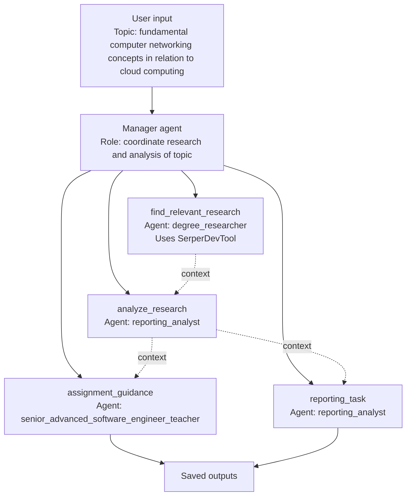

```mermaid
flowchart TD
    A["User input<br/>Topic: fundamental computer networking concepts in relation to cloud computing"] --> M["Manager agent<br/>Role: coordinate research and analysis of topic"]

    M --> B["find_relevant_research<br/>Agent: degree_researcher<br/>Uses SerperDevTool"]
    M --> C["analyze_research<br/>Agent: reporting_analyst"]
    M --> D["assignment_guidance<br/>Agent: senior_advanced_software_engineer_teacher"]
    M --> E["reporting_task<br/>Agent: reporting_analyst"]

    B -. context .-> C
    C -. context .-> D
    C -. context .-> E

    D --> F["Saved outputs"]
    E --> F
```