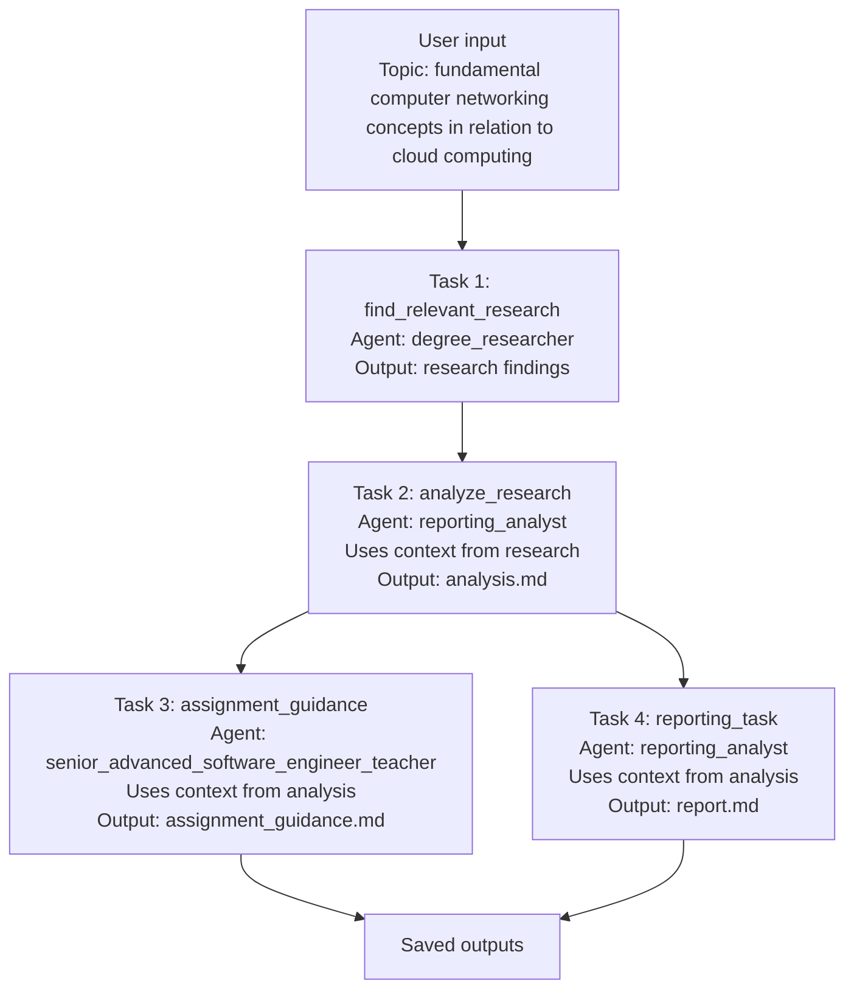

# Sequential process:

In a sequential workflow, each task runs in a fixed order. This makes the process easier to follow and debug, and it is probably the clearest starting point when learning how tasks and context fit together.